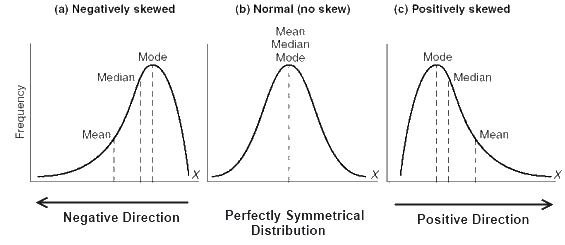

## Missing Data Handling

### 결측치 시각화

- `missingno` 패키지

  - `matrix` 메소드 : 데이터 프레임의 결측치를 매트리스 형태로 시각화, 누락 데이터는 흰색으로 나타남, 가장 오른쪽은 스파크 라인이며 각 행의 데이터 완성도를 표현

    ```
    !pip3 install missingno

    import missingno as msno

    msmo.matrix(df)
    plt.show()
    ```

    - `bar` 메소드 : 각 열의 누락데이터가 얼마나 존재하는지에 대해서만 시각화

      ```
      msno.bar(df)
      plt.show()
      ```

### 결측치 제거

- 어떤 열에 누락 데이터가 너무 많으면 그 열의 데이터를 제거해야 함
- `dropna()` 명령 : 누락 데이터가 존재하는 행이나 열 삭제
  ```
  df.dropna()
  ```
  - `thresh` 인수 : 특정 갯수 이상의 데이터가 있는 행만 남김
    ```
    df.dropna(thresh=4)
    ```
  - `axis` 인자 : 1로 설정하면 누락 데이터가 있는 '열'을 제거
    ```
    df.dropna(thresh=4, axis=1)
    ```

### column의 분포 시각화

```
# df의 한 column에 대하여 결측치가 있는 행을 제외하고 시각화
sns.distplot(df.col.dropna())
plt.show()
```

### 결측치 대체

1. (일괄 대체) scikit-learn 패키지의 `SimpleImputer` 클래스 사용

```
# 결측치 시각적 확인
msno.bar(df)
plt.show()

# SimpleImputer으로 결측치 대체
from sklearn.impute import SimpleImputer

imputer = SimpleImputer(strategy="median")
df_copy1 = df.copy()
df_copy1["col"] = imputer.fit_transform(df.col.values.reshape(-1,1))
# ! reshape에서 -1은 reshape할 array의 form을 열과 행 중 하나만 정하면 되고 나머지는 신경쓰지 않아도 될 때 넣어준다

# 결측치 대체 결과 시각적 확인
msno.bar(df_copy1)
plt.show()
```

1. (특성별 대체) `groupby` 및 `fillna` 사용

- `groupby` : 대상 데이터를 기준을 정해 그룹짓고 평균, 중앙값, 최빈값 등 대체할 대표값을 구함
  ```
  # tmax 열을 store_nbr 열을 기준으로 그룹지어 mean 연산을 수행
  df.tmax.groupby(df.store_nbr).mean()
  ```
  - 평균, 중앙값, 최빈값의 특성
    
    ```
    # tmax 열의 분포 확인
    g = sns.FacetGrid(df, hue="store_nbr", height=4, aspect=2)
    g.map(sns.kdeplot, "tmax")
    plt.show()
    ```
- `fillna` : 결측치 채우기

  ```
  # 간단하게 값으로 채우기
  df.fillna(0)

  # 앞 혹은 뒤에 있는 값으로 채우기
  df.fillna(method='ffill')
  df.fillna(method='bfill')

  # 지정된 값으로 채우기
  # key값은 column 이름
  values = {'A': 0, 'B': 1, 'C': 2, 'D': 3}
  df.fillna(value=values)

  # 함수 적용하여 채우기
  df_copy2 = df.copy()
  df_copy2['tmax'] = df.tmax.groupy(df.store_nbr).transform(lambda x : x.fillna(x.mean()))
  # ! lambda 함수에서 x는 column
  ```

### Reference

- [pandas.DataFrame.fillna](https://pandas.pydata.org/pandas-docs/stable/reference/api/pandas.DataFrame.fillna.html)
- [3.1 누락 데이터 처리](https://datascienceschool.net/view-notebook/8cbbdd4daaf84c0492d440b9a819c8be/)
- [Python numpy.reshape(-1)의 의미](https://sailing-sj66.tistory.com/15)
