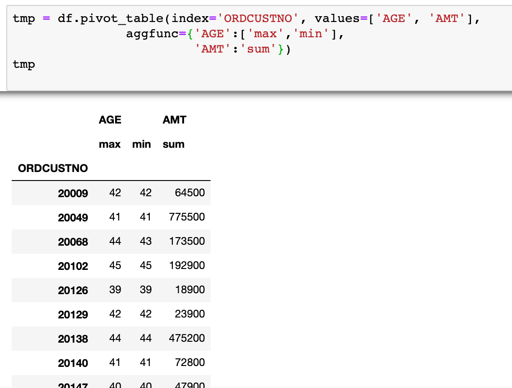

## Pandas

### pivot_table

- column마다 다른 aggfunc 적용 및 한 column에 여러 aggfunc 적용

```
tmp = df.pivot_table(index='ORDCUSTNO', values=['AGE', 'AMT'],
               aggfunc={
                   'AGE':['max','min'],
                   'AMT':'sum',
                       })
```



- aggfunc에 unique count 적용 : `aggfunc=lambda x: len(x.unique())`, x는 index별 해당 values

### MultiIndex

- 리스트 안의 리스트에 접근하는 것과 동일한 slicing 방식으로 column에 접근

```
tmp.columns
> MultiIndex(levels=[['AGE', 'AMT'], ['max', 'min', 'sum']], codes=[[0, 0, 1], [0, 1, 2]])

tmp['AGE']['max']
# 'max' column에 접근
```

### Week number

- 날짜 데이터에 해당하는 week number 반환
  - `pd.to_datetime`을 통해 column을 datetime 자료형으로 바꾼 뒤 datetime.week 사용
  ```
  import datetime as dt
  df['Pur_Week'] = df['Pur_Date_'].dt.week
  ```

### `df.where`

- 조건에 맞지 않는 값을 변경, 대체값을 지정하지 않으면 Nan값 return

  - `df.where(유지할 value의 조건, 변경할 value에 주입할 값)`

  ```
  s = pd.Series(range(5))

  s.where(s > 1)
  # 1 이하의 값만 남기고 나머지는 Nan값으로 대체

  s.where(s > 1, 10)
  # 1 이하의 값들은 10으로 대체
  ```

### `df.mask`

- 조건에 맞는 값을 변경, 대체 값을 지정하지 않으면 Nan값 return

  - `df.mask(변경할 value의 조건, 변경할 value에 주입할 값)`

  ```
  s = pd.Series(range(5))

  s.mask(s > 1)
  # 1 초과의 값만 남기고 나머지는 Nan값으로 대체

  s.where(s > 1, 10)
  # 1 초과한 값들은 10으로 대체
  ```

### `df.at`, `df.iat`

- 행과 열의 위치로 **한개**의 value에 접근, **값의 변경** 가능

  - `df.at(행 위치, 열 위치)`
  - `df.iat(행 숫자 위치, 열 숫자 위치)`
  - `df.loc` 및 `df.iloc`와 다른 점

    1. 여러 행과 열에 접근하는 것이 아니라 한 개의 행과 열로 한 개의 value에만 접근
    1. 한 개의 value에만 접근하기 때문에 가르키는 값이 분명하여 값의 대체 가능

    ```
    # 4번째 행, 'B'열에 접근
    df.at[4, 'B'] # return : 2

    df.at[4, 'B'] = 10

    df.at[4, 'B'] # return : 10
    ```

### Reference

- [pandas.DataFrame.mask](https://pandas.pydata.org/pandas-docs/stable/reference/api/pandas.DataFrame.mask.html#pandas.DataFrame.mask)
